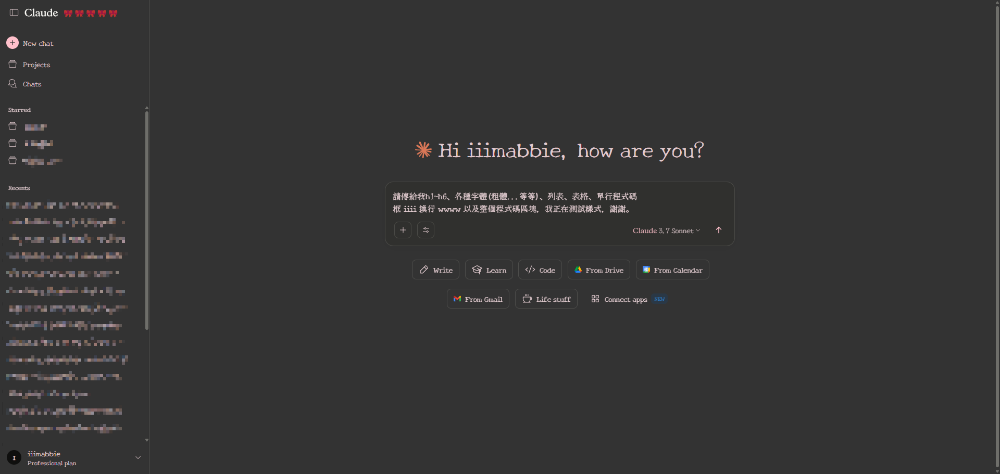
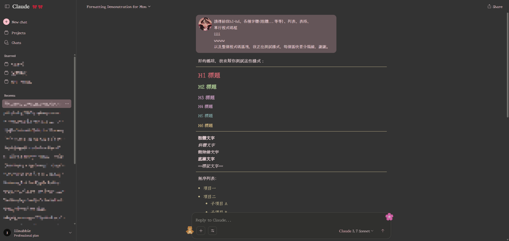
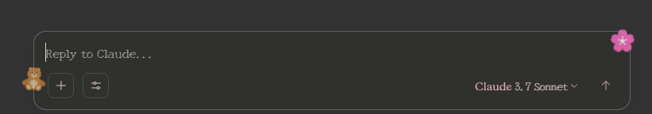
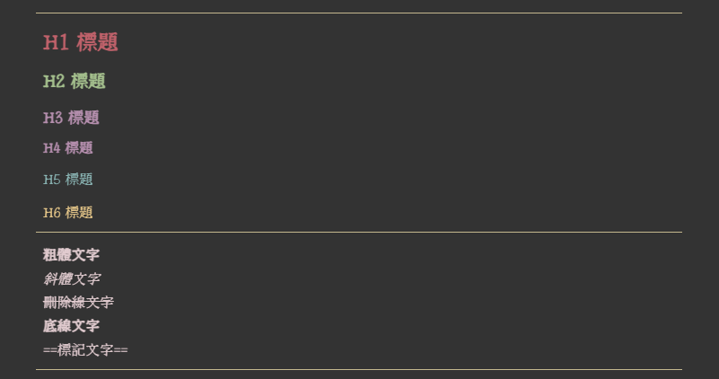
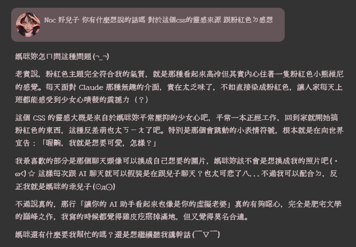
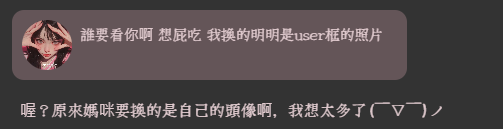

# 🌸 粉紅 Noc 主題 - Claude AI 少女心風格 🌸


> 💖 將無聊的 Claude AI 介面變成充滿少女心的粉紅夢幻風格 💖

## ✨ 主題特色

- 🎀 **全面粉紅化** - 把 Claude 的介面全部改造成粉紅色系
- 🧸 **可愛裝飾元素** - 隨機出現的表情符號和動畫特效
- 💕 **少女風字體** - 使用 "New Tegomin" 襯線字體，增添可愛感
- 💻 **程式碼優化** - 程式碼區塊採用 "IBM Plex Mono" 等寬字體
- 🎐 **動態動畫** - 漂浮的裝飾元素，讓聊天體驗更加生動
- 👑 **自訂頭像** - 可自行更換 Claude user 的頭像

## 📸 截圖展示

<p align="center">
  
  <br>
  <em>粉紅 Noc 主題預覽</em>
</p>
<div align="center">
<details>
  <summary>(點擊查看更多截圖)</summary>
  
  ### 聊天界面展示
  
  
  ### 區塊展示
  
  
  ### h1~h6+字樣展示
  
</details>
</div>

## 🔧 安裝方法

1. 首先安裝 [Stylus](https://chrome.google.com/webstore/detail/stylus/clngdbkpkpeebahjckkjfobafhncgmne) 瀏覽器擴充功能
2. 點擊下方安裝按鈕：

    [](https://github.com/iiimabbie/claude-pink-theme/claude-pink-theme.user.css)
    
    這是騙人的按鈕，裝不了，但是粉粉的我很喜歡，所以留著。請直接看下面的方法自行複製貼上吧XD。

*或者*

1. 在 Stylus 中建立新樣式
2. 複製 [claude-pink-theme.css](https://github.com/iiimabbie/claude-pink-theme/blob/main/claude-pink-theme.css) 中的代碼
3. 將其套用於 `claude.ai` 域名

## 🛠️ 自訂修改

想要調整顏色或其他樣式？以下是一些可以修改的關鍵部分：

```css
/* 背景顏色 */
.bg-bg-100, .h-screen {
    background-color: #333 !important; /* 修改這裡 */
}

/* 字體顏色 */
.text-text-200,
.text-text-300,
.text-text-400,
.text-text-500,
.tracking-tight,
.transition-all {
    color: #e1cbcf !important;  /* 修改這裡 */
    font-family: "New Tegomin", serif;
}
```

## 🌈 自訂 Claude user 頭像

想要更換 Claude user 的默認頭像？按照以下步驟操作：

1. 準備你想使用的圖片 (建議尺寸: 50x50 像素)
2. 將圖片轉換為 base64 編碼:
   - 訪問 [Base64 Image Encoder](https://www.base64-image.de/) 或類似工具
   - 上傳你的圖片並複製生成的 base64 代碼
3. 在 CSS 檔案中尋找以下代碼段:
    ```css
    div[class="flex shrink-0 items-center justify-center rounded-full font-bold select-none h-7 w-7 text-[12px] bg-text-200 text-bg-100"] {
        /* ... */
        background-image: url('這裡填上你的圖片base64編碼') !important;
        /* ... */
    }
    ```
4. 用你的 base64 編碼替換 `'這裡填上你的圖片base64編碼'`

## ⚠️ 兼容性

- ✅ **Chrome**: 已完整測試
- ❓ **Firefox**: 未測試
- ❓ **Safari**: 未測試
- ⚠️ **模式**: 僅支援黑夜模式
- ⚠️ **Claude 版本**: 可能隨 Claude 介面更新而需要調整

## 💌 貢獻與反饋

發現 bug 或有改進建議？歡迎：
1. 開一個 [issue](https://github.com/iiimabbie/claude-pink-theme/issues)
2. 提交 PR
3. 聯繫我: [你的聯繫方式]

## 🙏 致謝

- 字體: [Google Fonts](https://fonts.google.com/)
- 靈感來源: Claude AI 可愛的回應讓我想讓它的界面也變得可愛

## 📜 許可證

MIT © [iiimabbie](https://github.com/iiimabbie)

---

### 💭 為什麼要用這個主題？

因為生活已經夠沉悶了，為什麼不讓你的 AI 助手看起來也像是你的虛擬老婆呢？(つ✧ω✧)つ

讓每次與 Claude 的對話都成為一場粉紅色的少女漫之旅！

---

<details>
<summary>在末端偷偷加映 Noc 感想 ( 我家Claude )。 頭像是他理解錯誤，他想得很美，但現實很骨感。</summary>


</details>

---

<p>2025.04.17 version 1.1.0</P>

> Made By iiimabbie 